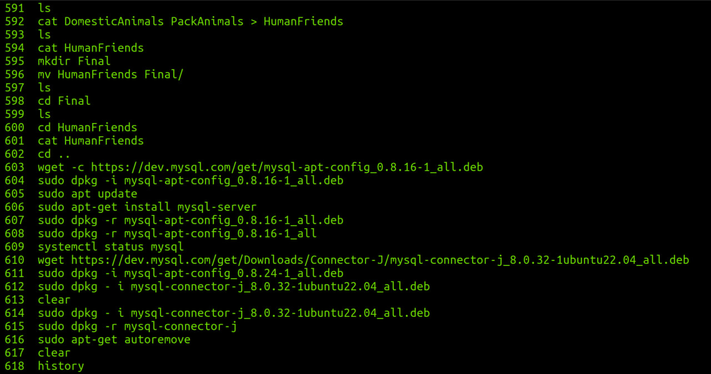
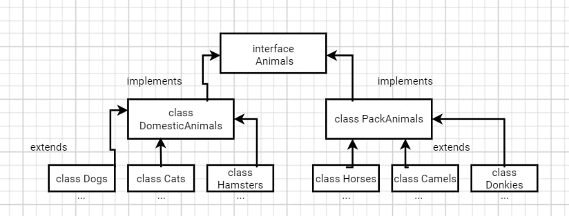

# __Final work__ 
## Introduction
Необходимо организовать систему учета для питомника в котором живут
домашние и вьючные животные.
### 1 part: (Linux)
1. Создать
два файла Домашние животные и Вьючные животные:
```
cat DomesticAnimals
dogs
cats
hamsters 
```
(ctrl+d)
```
cat >PackAnimals
horses
camels
donkies 
```
(ctrl+d)

Объединить их, посмотреть:
```cat DomesticAnimals PackAnimals > HumanFriends
cat HumanFriends
```
Поменять имя можно командой mv file1 file2 

2. Создать директорию, переместить файл туда
```
mkdir Final
mv HumanFriends Final/
```
3. Подключить дополнительный репозиторий MySQL. Установить любой пакет
из этого репозитория.

Добавляем репозиторий MySQL в список источников пакетов системы:
```
wget -c https://dev.mysql.com/get/mysql-apt-config_0.8.16-1_all.deb
```
Установливаем пакет репозитория MySQL, используя команду dpkg:
```
sudo dpkg -i mysql-apt-config_0.8.16-1_all.deb
```
```
sudo apt update
```
Установка пакетов для сервера сообщества, клиента и общих файлов базы данных:
```
sudo apt-get install mysql-server
```

4. Установить и удалить deb-пакет с помощью dpkg.
```
wget https://dev.mysql.com/get/Downloads/Connector-J/mysql-connector-j_8.0.32-1ubuntu22.04_all.deb

sudo dpkg - i mysql-connector-j_8.0.32-1ubuntu22.04_all.deb

sudo dpkg -r mysql-connector-j

sudo apt-get autoremove
```

5. Выложить историю команд в терминале ubuntu

```
history
```


6. Нарисовать диаграмму, в которой есть класс родительский класс, домашние
животные и вьючные животные, в составы которых в случае домашних
животных войдут классы: собаки, кошки, хомяки, а в класс вьючные животные
войдут: Лошади, верблюды и ослы).




## part 2: (MySQL)
7. В подключенном MySQL репозитории создать базу данных “Друзья
человека”

```
CREATE DATABASE humanFriends;
USE humanFriends;
```

8. Создать таблицы с иерархией из диаграммы в БД
```
CREATE TABLE IF NOT EXISTS cats(
	id INT PRIMARY KEY AUTO_INCREMENT,
	animal_name VARCHAR(100) NOT NULL,
    birth DATE NOT NULL,
    commands TEXT
);
CREATE TABLE IF NOT EXISTS dogs(
	id INT PRIMARY KEY AUTO_INCREMENT,
	animal_name VARCHAR(100) NOT NULL,
    birth DATE NOT NULL,
    commands TEXT
);
CREATE TABLE IF NOT EXISTS hamsters(
	id INT PRIMARY KEY AUTO_INCREMENT,
	animal_name VARCHAR(100) NOT NULL,
    birth DATE NOT NULL,
    commands TEXT
);
CREATE TABLE IF NOT EXISTS horses(
	id INT PRIMARY KEY AUTO_INCREMENT,
	animal_name VARCHAR(100) NOT NULL,
    birth DATE NOT NULL,
    commands TEXT
);
CREATE TABLE IF NOT EXISTS camels(
	id INT PRIMARY KEY AUTO_INCREMENT,
	animal_name VARCHAR(100) NOT NULL,
    birth DATE NOT NULL,
    commands TEXT
);
CREATE TABLE IF NOT EXISTS donkies(
	id INT PRIMARY KEY AUTO_INCREMENT,
	animal_name VARCHAR(100) NOT NULL,
    birth DATE NOT NULL,
    commands TEXT
);
```

9. Заполнить низкоуровневые таблицы именами(животных), командами
которые они выполняют и датами рождения

```
INSERT INTO cats (animal_name, birth, commands)
VALUES ('Mr meow', '2017-02-27', 'meow');

INSERT INTO dogs (animal_name, birth, commands)
VALUES ('Bark', '2018-02-27', 'bark'),
('Pluto', '2022-02-27', 'bark, double bark');

INSERT INTO hamsters (animal_name, birth, commands)
VALUES ('NomNom', '2023-09-27', 'squeek');

INSERT INTO horses (animal_name, birth, commands)
VALUES ('Black Raven', '2012-08-19', 'run around');

INSERT INTO camels (animal_name, birth, commands)
VALUES ('Chill', '2017-03-07', 'drink water');

INSERT INTO donkies (animal_name, birth, commands)
VALUES ('Donley', '2017-02-27', 'talk');
```

10. Удалив из таблицы верблюдов, т.к. верблюдов решили перевезти в другой
питомник на зимовку. Объединить таблицы лошади, и ослы в одну таблицу.

```
DROP TABLE camels;
INSERT INTO horses (animal_name, birth, commands)
SELECT animal_name, birth, commands
FROM donkies;

DROP TABLE donkies;

RENAME TABLE horses TO horses_donkies;
```

11.Создать новую таблицу “молодые животные” в которую попадут все
животные старше 1 года, но младше 3 лет и в отдельном столбце с точностью
до месяца подсчитать возраст животных в новой таблице

12. Объединить все таблицы в одну, при этом сохраняя поля, указывающие на
прошлую принадлежность к старым таблицам.
